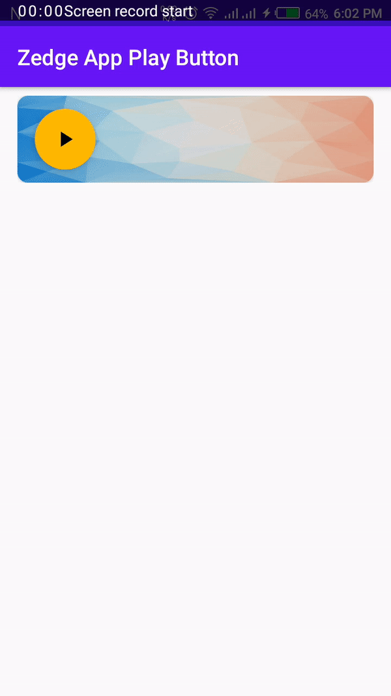

# PlayButton-Android
👏 The Zedge Android App Play Button Effect developed in Android using Kotlin.

[](https://jitpack.io/#DanishAmjad12/PlayButton-Android)

# Demo


# Installation 💻

Add this in your app's build.gradle file:
``` java
dependencies {
	        implementation 'com.github.DanishAmjad12:PlayButton-Android:1.0'
	}
  ```
  
# Usage 🧾

``` XML
  <com.danish.playbutton.PlayButton
        android:layout_width="wrap_content"
        android:id="@+id/playButton"
        app:play_button_icon="@drawable/ic_play_arrow"
        app:pause_button_icon="@drawable/ic_pause"
        app:play_button_default_background="@color/fab_background"
        app:card_background_color="@drawable/background"
        app:progress_color="@color/progress_background"
        android:layout_height="wrap_content"/>
```
        
# Customization and Attributes 🎨

All customizable attributes for Play Button

| Attribute Name| Default Value | Description
| ------------- | ------------- | ----------- |
|   app:play_button_icon  | @drawable/ic_play_arrow  | The default icon of the Play button
|   app:pause_button_icon | @drawable/ic_pause  | The default icon of the Pause button
|    app:play_button_default_background | @color/fab_background  | The background color of the fab button
|    app:card_background_color | @drawable/background | The default background image of the frame view
|     app:progress_color | @color/progress_background | The default audio progress color 

# Play Button Listener

``` kotlin 
override fun onCreate(savedInstanceState: Bundle?) {
        super.onCreate(savedInstanceState)
        setContentView(R.layout.activity_main)

        playButton.playButtonListener=listener

    }

    private val listener = object : PlayButton.OnButtonListener{
        override fun onPlayButtonClicked(playButton: PlayButton) {
                playButton.setAudioFileName("audio")
        }
    }
    
     override fun onDestroy() {
        super.onDestroy()
        playButton.stopAudio()
    }

    override fun onPause() {
        super.onPause()
        playButton.pauseAudio()
    }
    
 ```
 # Developed By
 
 ```
 DANISH AMJAD follow me 👇
 ```
 * Twitter (https://twitter.com/DanishAmjad10)
 * Medium (https://medium.com/@DaniAmjad)
 * LinkedIn (https://www.linkedin.com/in/danish-amjad-06a43090/)
 * YouTube (https://www.youtube.com/channel/UC06GphxCS1gzZhdT9dn6kQA?view_as=subscriber)
 
 #  License
 Copyright 2020 Danish Amjad

Licensed under the Apache License, Version 2.0 (the "License");
you may not use this file except in compliance with the License.
You may obtain a copy of the License at

   http://www.apache.org/licenses/LICENSE-2.0

Unless required by applicable law or agreed to in writing, software
distributed under the License is distributed on an "AS IS" BASIS,
WITHOUT WARRANTIES OR CONDITIONS OF ANY KIND, either express or implied.
See the License for the specific language governing permissions and
limitations under the License.
